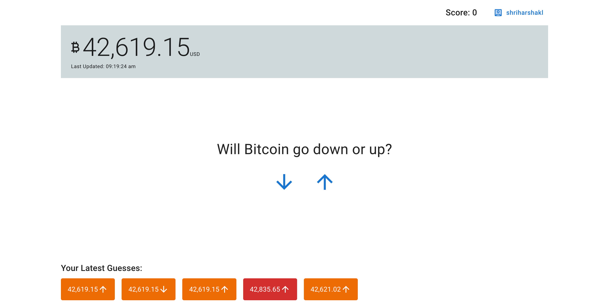

# Bitcoin guessing game

A simple game where players guess whether the bitcoin price will go up or down in the next 60 seconds.

## How to play

1. Login by clicking on the login button on the top-right and entering a username.
2. Make your guess by clicking on the up/down arrow buttons and confirming your guess.
3. Wait for up to 60 seconds to the result. If your guess is correct, your score is incremented, if it is incorrect, your is score is decremented and if the bitcoin price did not change in the last 60 seconds, your score will remain unchanged.

## How to run locally

### Server

1. Set the DATABASE_URL with a deployed mongodb server URL in **.env**
2. This application uses a [3rd party public API](https://api.api-ninjas.com) for fetching the bitcoin price. Set the API_KEY for the public API in **.env**
3. Set PORT in **.env** to 3000
4. Run `npm install` followed by `npm run dev` to start the server

### UI

1. Make sure that VITE_BASE_URL is set in **.env**
2. Run `npm install` followed by `npm run dev` to start the UI server

## How it works

### User creation

1. When a username is entered, if the user does not exist in the backend, it is created, otherwise the given user information is fetched. Username is stored in browser's localStorage to maintain login information across browser sessions.
2. When a guess is made, it is persisted in the backend as UNRESOLVED, along with the price at which the guess was made.
3. A background job runs every 15 seconds to resolve any unresolved guesses. If 30 seconds have passed since a guess was made, and the bitcoin price did not change, the guess is marked as INDETERMINATE and resolved without change the player's score.
4. If a guess was correct, the user's score is incremented, and if it was incorrect, the user's score is decremented.
